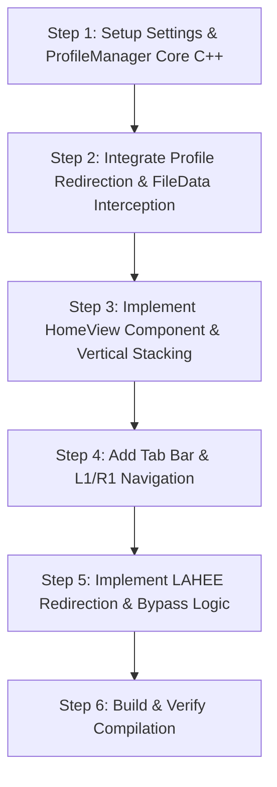

# Implementation Plan: Native C++ Profiles, iiSU Home View, and Offline RetroAchievements

This document outlines the detailed architecture, file layouts, and C++ class designs to implement the requested features cleanly on the `attempt2` branch of EmulationStation.

---

## 1. Directory Structure & Profile Sandboxing (`ProfileManager`)

Instead of modifying RetroArch config files dynamically using complex regex or scripts during launch, we will redirect save/state/screenshot directories once via symbolic links, and intercept user-specific metadata in memory.

### Filesystem Layout
All profile-related data will reside under `/storage/roms/profiles`:
```
/storage/roms/profiles/
├── profiles.json                   # List of profiles (IDs, names, avatars)
├── active                          # Symlink pointing to the active profile directory
├── 1/                              # Profile 1 (Default: "Player")
│   ├── savestates/                 # Sandboxed save and state files
│   ├── screenshots/                # Sandboxed screenshots
│   ├── favorites.txt               # List of favorite games (ROM absolute paths)
│   └── stats.json                  # Play counts and last played timestamps
└── 2/                              # Profile 2 ("Player 2")
    ├── savestates/
    ├── screenshots/
    ├── favorites.txt
    └── stats.json
```

### Setup & Directory Redirection (First Boot)
When EmulationStation starts:
1. `ProfileManager` checks if `/storage/roms/profiles` exists. If not, it creates it.
2. If `/storage/roms/profiles/active` is missing, it creates profile `1` (name: "Player", avatar: default), and links `/storage/roms/profiles/active` -> `/storage/roms/profiles/1`.
3. **Save/State Redirection**:
   - If `/storage/roms/savestates` is a normal directory, ES moves its files into `/storage/roms/profiles/1/savestates`, deletes `/storage/roms/savestates`, and creates it as a symlink pointing to `/storage/roms/profiles/active/savestates`.
4. **Screenshot Redirection**:
   - If `/storage/roms/screenshots` is a normal directory, ES moves its files into `/storage/roms/profiles/1/screenshots`, deletes `/storage/roms/screenshots`, and creates it as a symlink pointing to `/storage/roms/profiles/active/screenshots`.

### In-Memory Metadata Interception
To isolate favorites and play stats per profile without corrupting or modifying shared `gamelist.xml` files:
- **`FileData::getMetadata`** and **`FileData::setMetadata`** will be updated.
- If the key is `MetaDataId::Favorite`, `MetaDataId::PlayCount`, or `MetaDataId::LastPlayed`, it redirects the read/write to `ProfileManager::getInstance()`.
- `ProfileManager` maintains an in-memory cache of favorites (`std::unordered_set<std::string>`) and play stats (`std::unordered_map<std::string, GameStats>`) for the active profile, saving them to `favorites.txt` and `stats.json` whenever they are modified.

---

## 2. The iiSU-style Home View (`HomeView`)

We will stack the views vertically to avoid interfering with themes or existing carousel code. The camera translates vertically:
- **Y = 0**: `HomeView` (Dashboard)
- **Y = ScreenHeight**: `SystemView` (Carousel)
- **Y = ScreenHeight * 2**: `GameListView`s

### The Tile Grid Architecture
The `HomeView` will display a dynamic grid layout (4 columns by 3 rows). Each widget or action button is implemented as a "Tile" containing a `GuiComponent` with a specified grid coordinate `(col, row)` and span `(colSpan, rowSpan)`.

```
+-----------------------------------+-----------------------------------+
|                                   |                                   |
|       [ PROFILE WIDGET ]          |         [ CLOCK & STATUS ]        |
|            (2 x 1)                |             (2 x 1)               |
|                                   |                                   |
+-----------------------------------+-----------------+-----------------+
|                                   |                 |                 |
|                                   |    [ BROWSE ]   |  [ ACHIEVE-     |
|                                   |     (1 x 1)     |   MENTS ] (1x1) |
|     [ CONTINUE PLAYING ]          |                 |                 |
|           (2 x 2)                 +-----------------+-----------------+
|                                   |                 |                 |
|                                   |   [ PROFILES ]  |  [ SETTINGS ]   |
|                                   |     (1 x 1)     |     (1 x 1)     |
|                                   |                 |                 |
+-----------------------------------+-----------------+-----------------+
```

### Tile Specifications & Layout:
1. **Profile Widget** (Col 0, Row 0, Span 2x1):
   - Displays the active profile avatar (circular format) and profile name (e.g. "Player").
2. **Clock & Status Widget** (Col 2, Row 0, Span 2x1):
   - Displays a clean real-time clock, a battery percentage icon, and a Wifi signal indicator.
3. **Continue Playing Widget** (Col 0, Row 1, Span 2x2):
   - Displays the last played game with cover art taking up the full 2x2 tile space. Shows a small overlay with the game title and play progress.
   - Selecting this tile and pressing "A" launches the game immediately.
4. **Browse Systems Tile** (Col 2, Row 1, Span 1x1):
   - Clean icon/text tile that scrolls down to the `SystemView`.
5. **Achievements Tile** (Col 3, Row 1, Span 1x1):
   - Action icon to open `GuiRetroAchievements`.
6. **User Profiles Tile** (Col 2, Row 2, Span 1x1):
   - Action icon to open `GuiProfileManager`.
7. **Settings Tile** (Col 3, Row 2, Span 1x1):
   - Action icon to open the main menu.

### Grid Navigation & Focus Management:
- We track the currently focused grid coordinate `(focusCol, focusRow)`.
- When a direction is pressed (Up, Down, Left, Right):
  1. We search for the closest tile in that direction.
  2. Because tiles span multiple grid cells (e.g. the 2x2 Continue Playing tile covers cell (0,1), (0,2), (1,1), and (1,2)), entering any cell covered by a tile will focus that entire tile.
  3. Focus movement is smooth, using standard bounding-box proximity calculations.
- Focused tiles display a glowing border overlay (premium capsule/card styling) with subtle micro-animations (e.g., slight scaling when focused).

### Screen Tabs (`[ HOME ]  [ SYSTEMS ]`)
- We will draw a persistent tab bar at the top of the screen when in `HOME_VIEW` or `SYSTEM_SELECT` modes.
- To keep it fixed on the screen while the camera transitions vertically, the tab bar will be rendered in `ViewController::render` using the `parentTrans` (screen space) matrix instead of the camera's `trans` matrix.
- Pressing `L1`/`R1` (shoulder buttons) will trigger a tab switch:
  - If on `SystemView` and `L1` is pressed -> `goToHomeView(false)` (scrolls up).
  - If on `HomeView` and `R1` is pressed -> `goToSystemView(ActiveSystem, false)` (scrolls down).

---

## 3. Modular LAHEE Offline Achievements Integration

We will redirect RetroAchievements API endpoints and bypass online connectivity/login requirements when a local server is specified.

### Configuration
Add a setting `RetroAchievementsServerURL` (stored in settings/systemconf) that defaults to `"https://retroachievements.org"`.

### URL Redirection
In `RetroAchievements.cpp`, we introduce `resolveUrl(const std::string& url)`:
- If `RetroAchievementsServerURL` is set to a custom URL (e.g. `http://127.0.0.1:8000/laheer/` or any local IP):
  - Any URL starting with `https://retroachievements.org` is rewritten to `<customUrl>/dorequest.php?r=<method>`.
  - Image URLs starting with `http://i.retroachievements.org` are rewritten to `<customUrl>/Badge/` or similar local badge folder.

### Bypass Checks
1. **Login Test Bypass**:
   - In `RetroAchievements::testAccount`, if `RetroAchievementsServerURL` is custom, skip the network request entirely and return `true` with a mock token `"local_token"`.
2. **Network Warning Bypass**:
   - In `SystemView::input` (line 1641) and other achievement triggers, check `isNetworkAvailableForCheevos()`. If a custom server URL is set, return `true` immediately to skip the "YOU ARE NOT CONNECTED TO A NETWORK" warning dialog.

---

## 4. Work Breakdown & Subagent Orchestration

To implement this systematically and avoid compile errors, we will divide the work into modular steps, invoking subagents for execution:



### Proposed Action Items for Subagents:
- **Subagent A (Core Profiles)**: Implement `ProfileManager.h/.cpp` and integrate metadata interception in `FileData.h` / `FileData.cpp`.
- **Subagent B (HomeView & Navigation)**: Implement `HomeView.h/.cpp`, vertical stacking in `ViewController`, and L1/R1 tab controls.
- **Subagent C (LAHEE & Network)**: Implement `resolveUrl`, bypass checks, settings keys, and test offline achievement flows.
- **Subagent D (Testing & Compiling)**: Run compile checks using CMake on the local macOS environment (syntax validation) to make sure there are no compiler warnings or errors.
